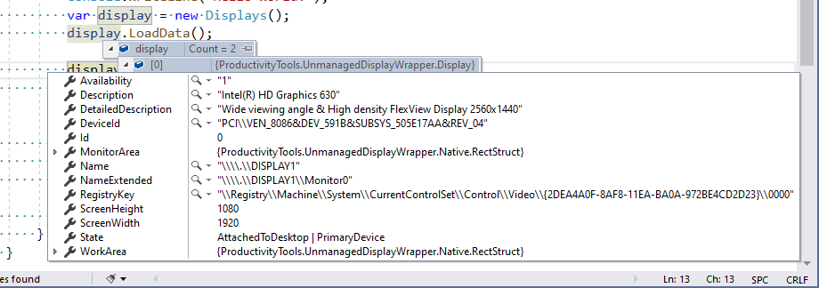

<!--Category:C#,PowerShell--> 
 <p align="right">
    <a href="https://www.nuget.org/packages/ProductivityTools.UnmanagedDisplayWrapper/"></a>
    <a href="http://productivitytools.tech/Unmanaged-Display-Wrapper/"><a> 
    <a href="https://github.com/pwujczyk/ProductivityTools.UnmanagedDisplayWrapper"></a>
</p>
<p align="center">
    <a href="http://http://productivitytools.tech/">
        
    </a>
</p>

# Unmanaged Display Wrapper

Library wraps P/Invoke (platform invoke) unmanaged methods in c# class. It allows to manage the external and internal display. Currently it exposes methods to position screen on the right and left.

<!--more-->

The main object of the library is the ``Displays`` it inherit from ``List<Display>`` and exposes 5 methods:

```c#
    public interface IDisplays
    {
        void LoadData();
        void MoveExternalDisplayToRight();
        void MoveExternalDisplayToLeft();
        void MoveMainDisplayToLeft();
        void MoveMainDisplayToRight();
    }
```

All ``Move*`` methods before doing their thing are invoking the ``LoadData`` internally. 

After calling ``LoadData`` details about display can be retrieved from the object.



``Move*`` methods don't return any information.

- What is the difference between moving external and main display?
- I don't know. When I implemented moving main display my icons on the desktop were randomly moved, so I did also the external methods, which doesn't have this drawback. Maybe if you will have 3 monitors some difference will occur. 